# SQS

  

---

## SQSの型
----

### メッセージ型

    

        メッセージ一つ1つが単独で処理することができる
    

  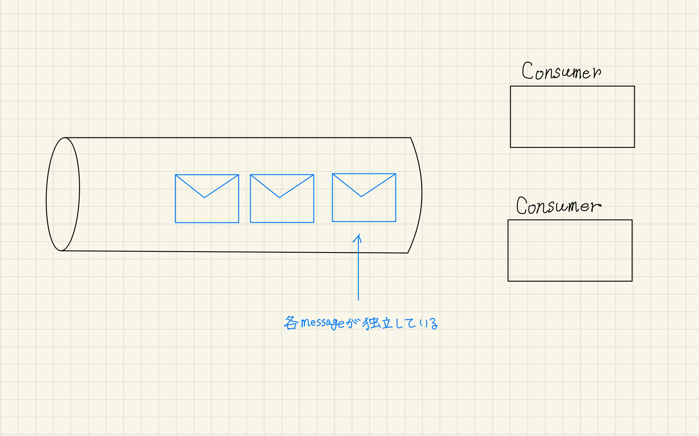

----

### P2P

    

        1つのメッセージに対して、受信者が1つになる
    

  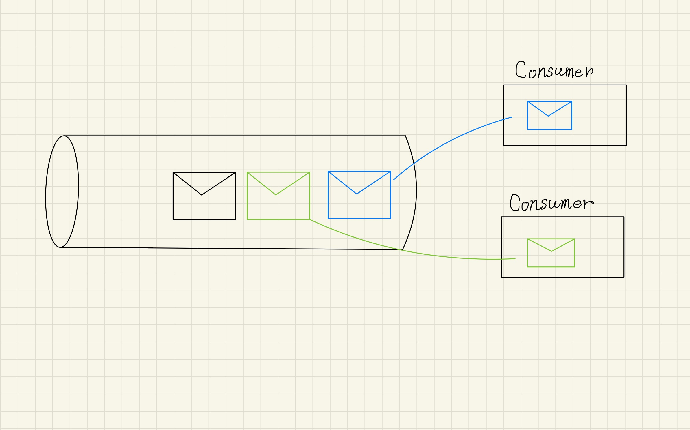

----

### Pull型

    

        データは一度キューに格納される 
        データの取得はconsumerが能動的に行う
    

  

----
### まとめ

    

        独立した一つ一つのメッセージデータを扱い、 
        1つのデータは1つのconsumeが取得するP2P型であり、 
        consumerが能動的にデータを取得するpull型のサービス
    

  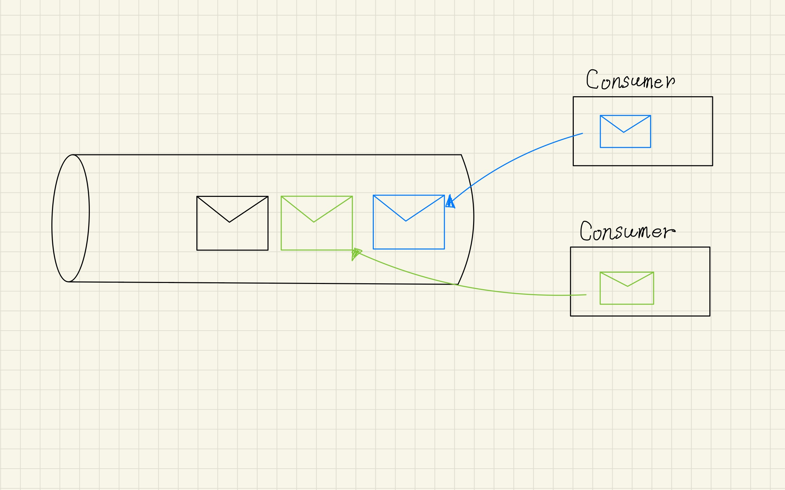

---
## キューの種類
----
### standardキュー

    

        ベストエフォートの順序で処理されるキュー 
        配信についてもat least onceであり、重複する可能性が残る 
        その分、スループットは無制限になる
    

  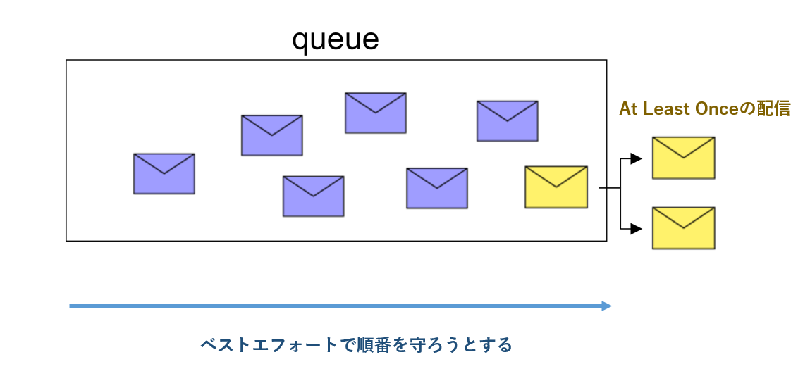

----
### fifoキュー

    

        配信順序を受信順序と厳密に一致させるキュー 
        順序はキュー全体で管理されるのではなく、メッセージグループID内で管理される 
        配信についてもメッセージ重複IDを利用した重複排除の仕組みが組み込まれている
    

  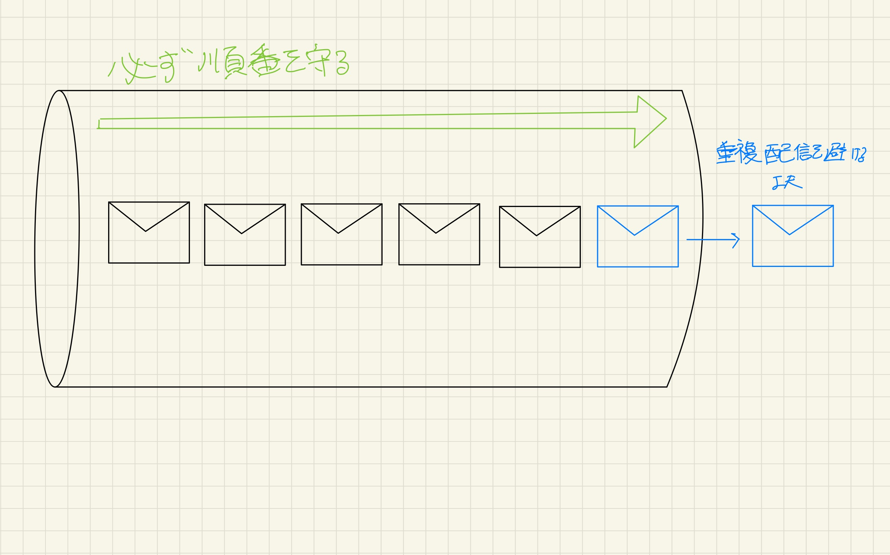

---
## 基本機能(standardキュー)
----
### ポーリング

    

        consumerがSQSに対してメッセージを受信しにいく処理 
        ショートポーリング:メッセージがあれば返却、なければないと即時に返信 
        ロングポーリング:メッセージがあれば返却、なければ指定時間待機してから返信
    

  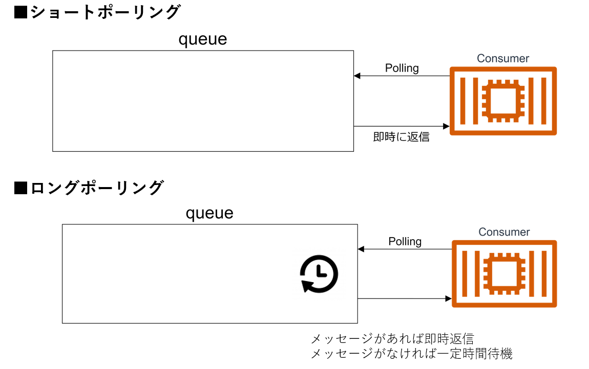

----
### メッセージの削除（受信ハンドル）

    

        SQSでは、処理を完了時にキューのメッセージをconsumerが削除する 
        consumerがメッセージを受信した際に、SQSからから受信ハンドルが配信される 
        SQSは、メッセージを受信し処理完了時に受信ハンドルを指定して削除を実行する
    

  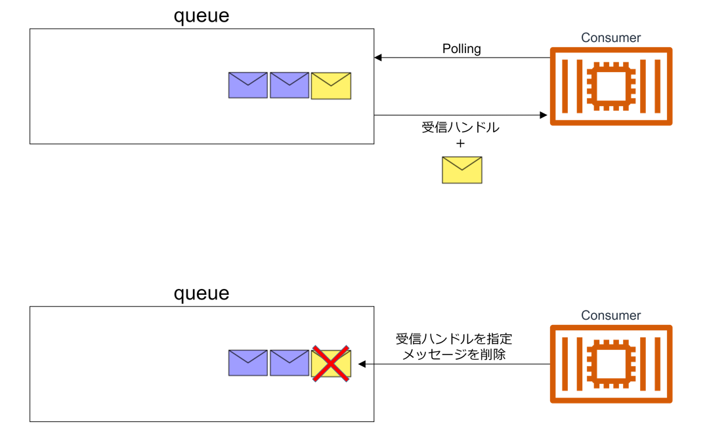

----
### 可視性タイムアウト

    

        consumer-Xが受信したメッセージを別consumerが認識しなくなる時間 
        この時間はタイムアウトの時間などを鑑みて決定する必要がある 
        可視性タイムアウト経過後、別のconsumerに配信されると受信ハンドルが新規発行され 
        consumer-Xが受け取った古い受信ハンドルでは削除できなくなる
    

  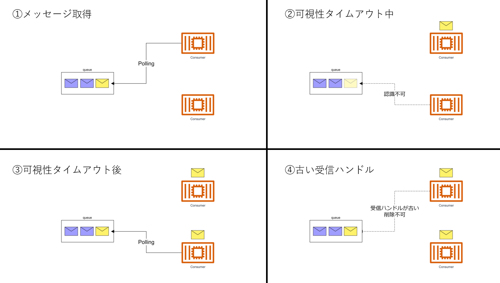

----
### 遅延キューとメッセージタイマー

    

        メッセージがキューに入ってから処理されるまでの遅延時間 
        遅延キューを利用すればキュー単位で、 
        メッセージタイマーを利用すればメッセージ単位で適用される
    

  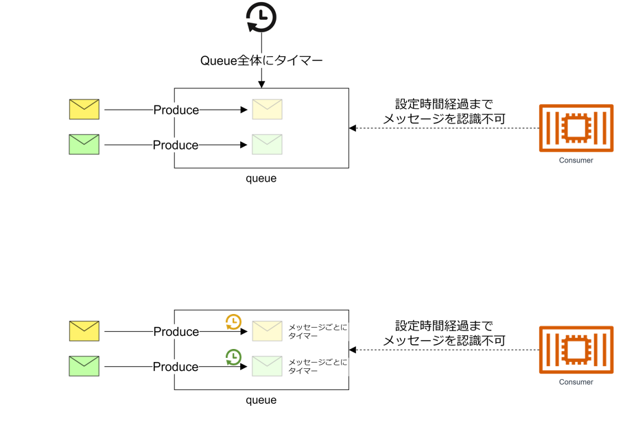

----
### DLT

    

        メッセージが配信されて、処理が失敗した場合に再配信される 
        事前設定した所定の回数再配信された場合、 
        DLQ(Dead Letter Queue)として設定した別キューに配信される
    

  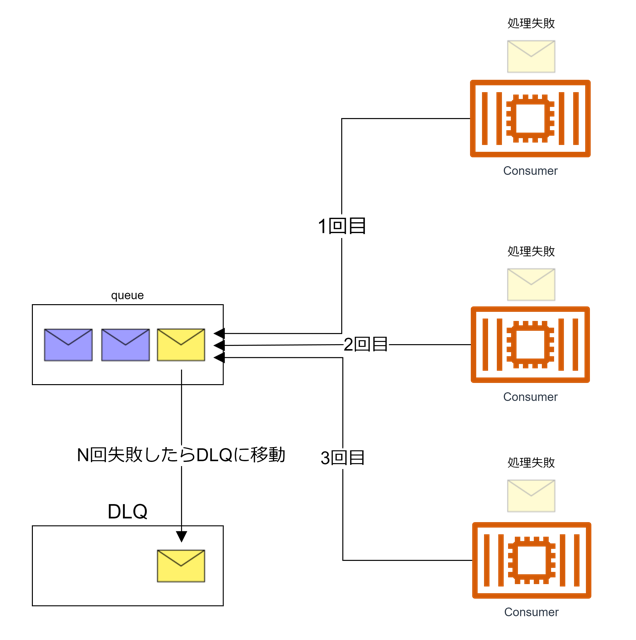

---
## FIFOキュー
----
### メッセージグループID

    

        メッセージ送信時に指定する必須のID 
        メッセージはこのグループIDごとに管理され、ID内で順番が担保される 
        kafkaのpartitionに対応するが、事前に数を指定する必要性はない
    

  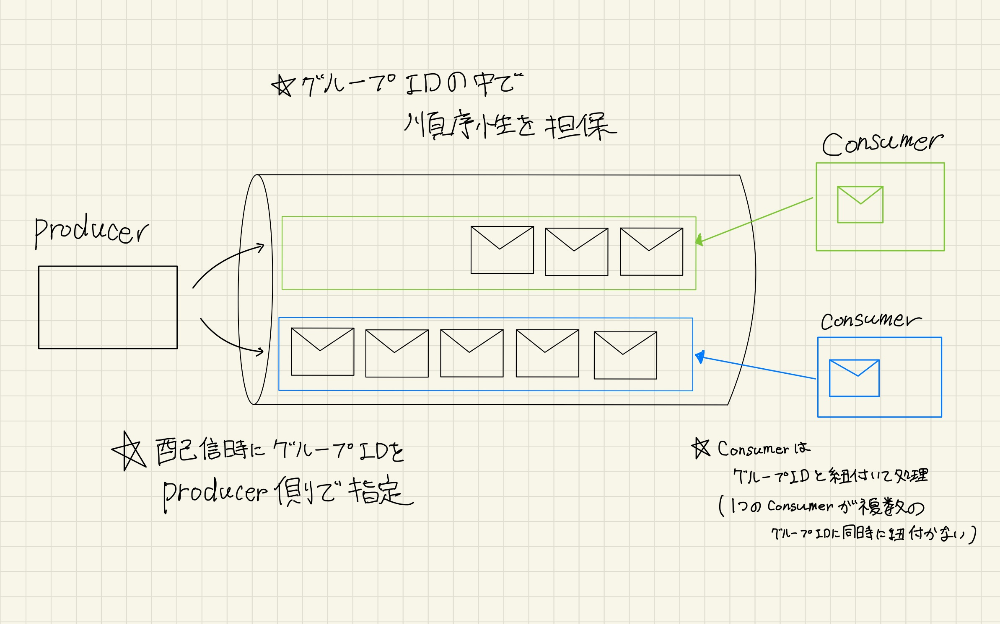

----
### メッセージ重複ID

    

        メッセージ送信時に指定するID 
        メッセージを配信する際に重複IDを確認し 
        5分間の間は同じ重複IDのメッセージを配信しなくなる
    

  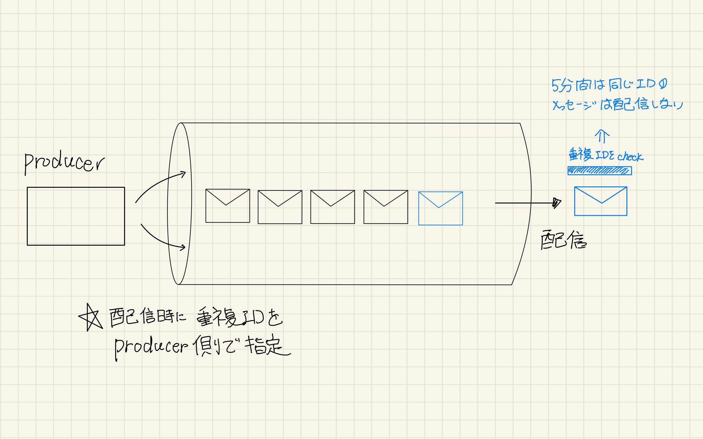

